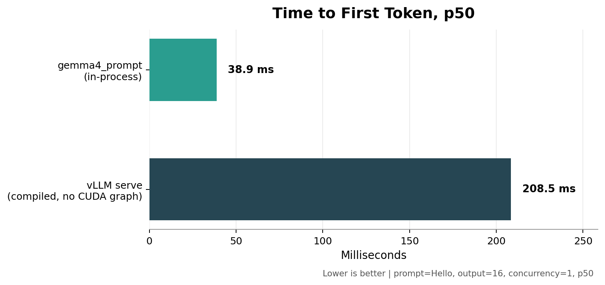
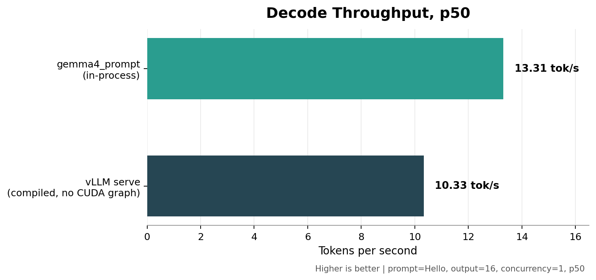

# gemma.c

`gemma.c` is an experimental inference runtime for Gemma dense models, with an initial focus on running the Gemma 4 12B Unified text path efficiently on NVIDIA RTX A6000 GPUs.

The long-term goal is a highly optimized mega-kernel inference path, w/ minimal imports.

The current work is to implement kernels individually, assemble a correct unfused path, benchmark it, and then fuse measured hot paths together incrementally.

## Benchmark

Single-user Gemma 4 12B prompt benchmark on an NVIDIA RTX A6000 (Jun 25):

| Runner | p50 TTFT | p50 TPOT | p50 decode TPS |
| --- | ---: | ---: | ---: |
| `gemma4_prompt` local | 38.878 ms | 75.120 ms | 13.312 tok/s |
| vLLM serve, compiled, no CUDA graph | 208.512 ms | 96.762 ms | 10.335 tok/s |

My agents tell me they love working in this repo. It is built heavily w/ them in mind!
