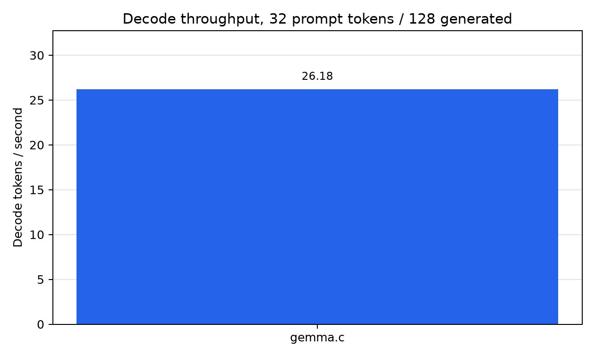
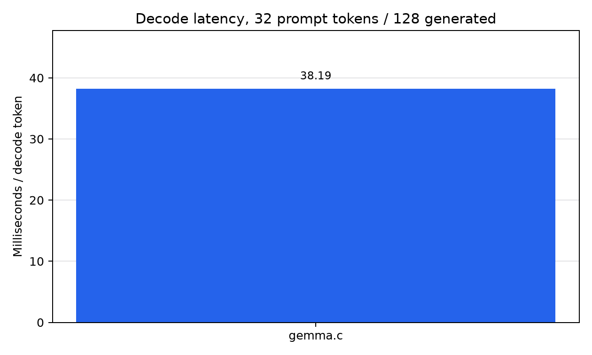

# gemma.c

`gemma.c` is an experimental inference runtime for Gemma dense models, with an initial focus on running the Gemma 4 12B Unified text path efficiently on NVIDIA RTX A6000 GPUs.

The long-term goal is a highly optimized mega-kernel inference path, w/ minimal imports, meant for one person to use.

As of Jun 27, we are able to do this with a clean 12,195 LOC. For noe we also don't support batched decode, or any fancy stuff.

The current work is to implement kernels individually, assemble a correct unfused path, benchmark it, and then fuse measured hot paths together incrementally.

## Benchmark

Endpoint-free Gemma 4 12B BF16 decode benchmark on an NVIDIA RTX A6000
(Jun 27). Each runner used batch `1`, a synthetic `32`-token prompt, `128`
requested output tokens, no speculative decoding, and no prefix cache reuse.
The local path uses `offline-decode`: generated tokens stay on GPU during the
decode loop, and the runner synchronizes the CUDA stream once at the end of each
request. `gemma.c` and vLLM report decode latency by subtracting a one-token
generation baseline from the 128-token run, then dividing by the `127` decode
steps.

| Runner | Decode latency | Decode TPS | Status |
| --- | ---: | ---: | --- |
| vLLM `bench latency` | 38.480 ms/token | 25.987 tok/s | ok |
| `gemma4_prompt` `offline-decode` | 72.925 ms/token | 13.713 tok/s | ok |

Raw summary: `docs/benchmarks/decode_32p128g_b1_no_spec_summary.json`.

My agents tell me they love working in this repo. It is built heavily w/ them in mind!
