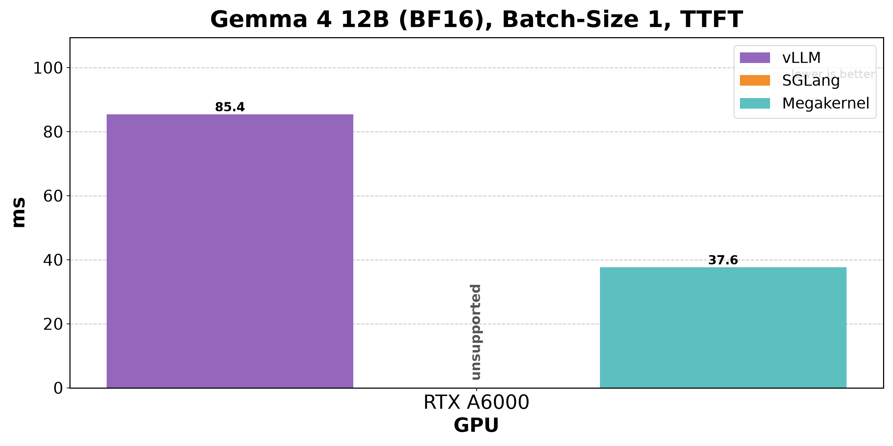
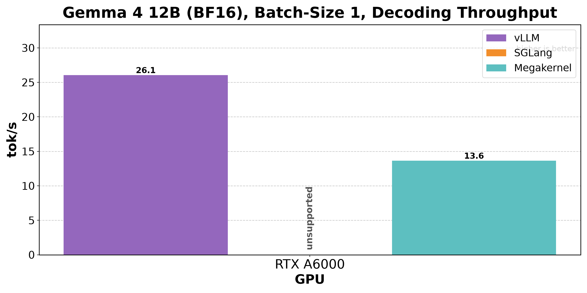

# gemma.c

`gemma.c` is an experimental inference runtime for Gemma dense models, with an initial focus on running the Gemma 4 12B Unified text path efficiently on NVIDIA RTX A6000 GPUs.

The long-term goal is a highly optimized mega-kernel inference path, w/ minimal imports, meant for one person to use.

As of Jun 27, we are able to do this with a clean 12,195 LOC. For noe we also don't support batched decode, or any fancy stuff.

The current work is to implement kernels individually, assemble a correct unfused path, benchmark it, and then fuse measured hot paths together incrementally.

## Benchmark

Single-user Gemma 4 12B BF16 prompt benchmark on an NVIDIA RTX A6000 (Jun 27).
Each measured run used 391 closed-loop requests, one `Hello` prompt token, 256
requested output tokens per request, `100,096` measured output tokens total,
and max request concurrency `1`.

| Runner | p50 TTFT | p50 TPOT | Output TPS | Measured time |
| --- | ---: | ---: | ---: | ---: |
| vLLM serve | 85.414 ms | 38.191 ms | 26.057 tok/s | 3841.4 s |
| SGLang serve | unsupported | unsupported | unsupported | unsupported |
| `gemma4_prompt` local | 37.607 ms | 73.418 ms | 13.647 tok/s | 7334.9 s |

SGLang 0.5.9 was installed and upgraded to Transformers 5.12.1 so it could
parse `Gemma4UnifiedConfig`, but its generic Transformers backend failed during
generation on Gemma 4 Unified's heterogeneous sliding/global KV shapes.

My agents tell me they love working in this repo. It is built heavily w/ them in mind!
