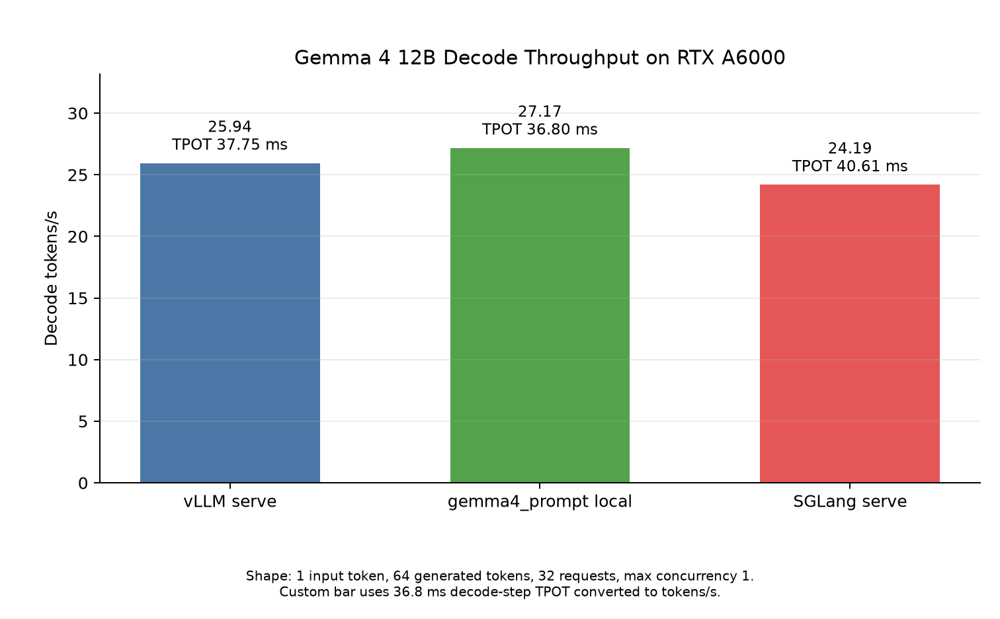
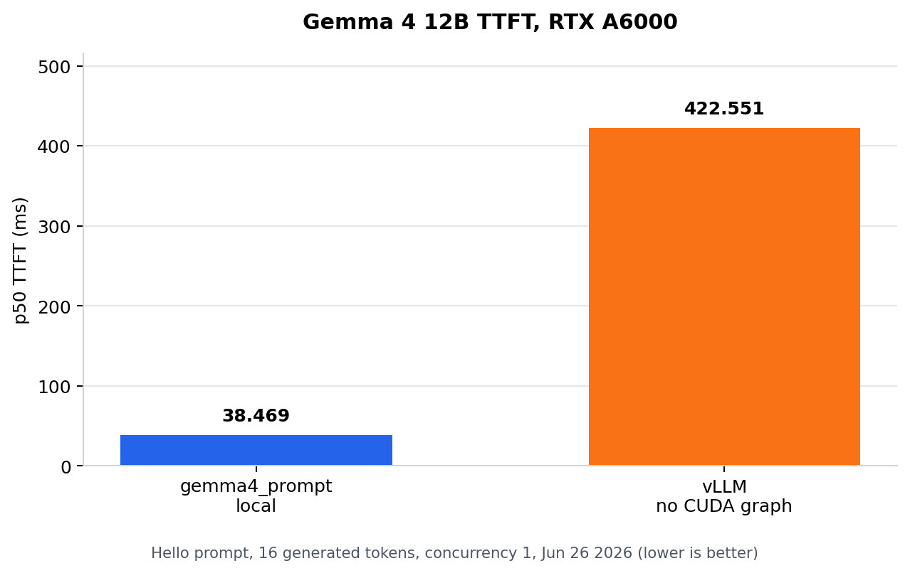
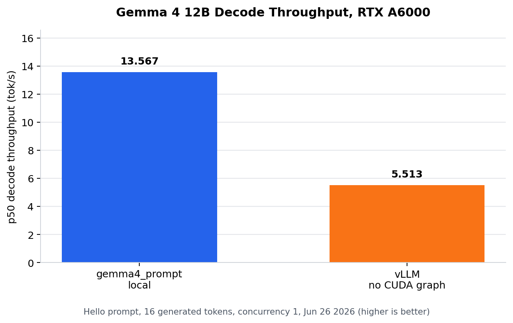

# gemma.c

`gemma.c` is an experimental inference runtime for Gemma dense models, with an initial focus on running the Gemma 4 12B Unified text path efficiently on NVIDIA RTX A6000 GPUs.

The long-term goal is a highly optimized mega-kernel inference path, w/ minimal imports.

The current work is to implement kernels individually, assemble a correct unfused path, benchmark it, and then fuse measured hot paths together incrementally.

## Current Decode Snapshot

Small single-user decode snapshot on July 1, using 1 input token, 64 generated
tokens, 32 measured requests, and max concurrency `1`. The custom bar uses
`36.8 ms` decode-step TPOT converted to tokens/s.

## Benchmark

Single-user Gemma 4 12B prompt benchmark on an NVIDIA RTX A6000 (Jun 26):

| Runner | p50 TTFT | p50 TPOT | p50 decode TPS |
| --- | ---: | ---: | ---: |
| `gemma4_prompt` local | 38.469 ms | 73.707 ms | 13.567 tok/s |
| vLLM serve, compiled, no CUDA graph | 422.551 ms | 181.401 ms | 5.513 tok/s |

The local runner is slightly faster than the previous Jun 25 run
(`38.878 ms` TTFT, `75.120 ms` TPOT, `13.312 tok/s`). Today's vLLM serving
baseline was slower after repeated warm passes; the first pass also emitted
Triton JIT warnings during inference.

My agents tell me they love working in this repo. It is built heavily w/ them in mind!
