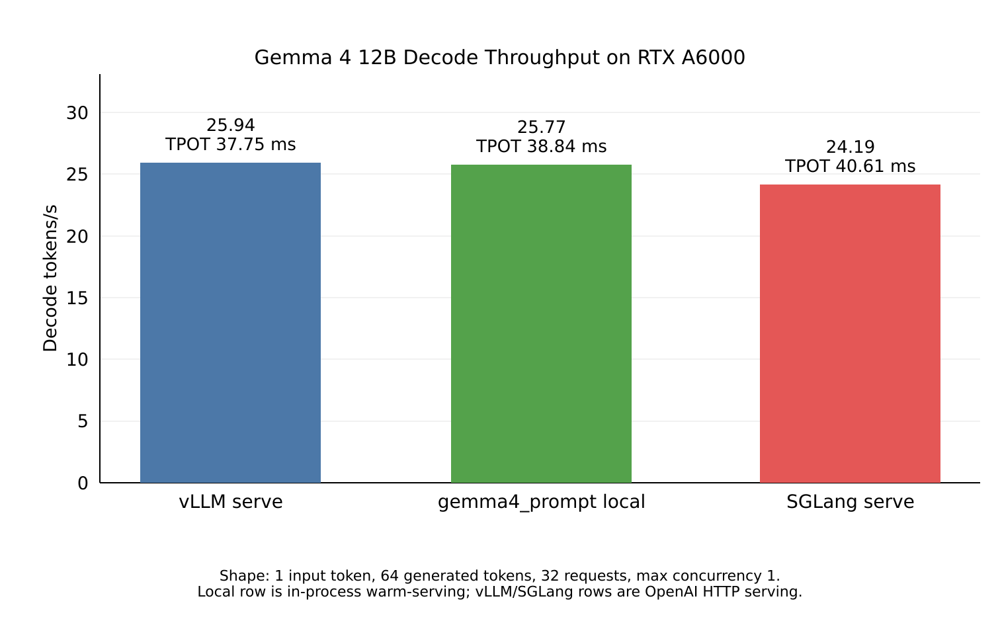
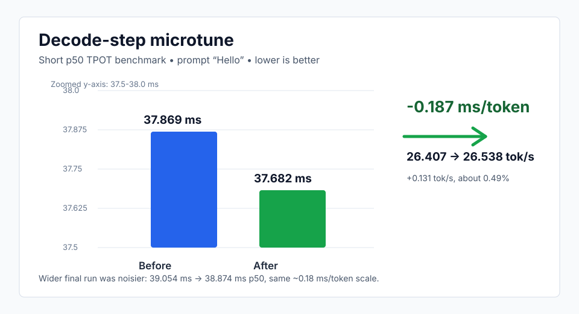

# gemma.c

`gemma.c` is an experimental inference runtime for Gemma dense models, with an initial focus on running the Gemma 4 12B Unified text path efficiently on NVIDIA RTX A6000 GPUs.

We currently have a fully built decode megakernel, but prefill isn't fused yet. For now, my goal is to get decode to ~15-20% above SGL and vLLM. We are currently hovering around <5%

## Current Decode Snapshot

Small single-user decode snapshot on July 1, 2026, using Gemma 4 12B-it BF16 on
an RTX A6000, 1 input token, 64 generated tokens, 32 measured requests, 2
warmups, and max concurrency `1`. The custom bar uses the best observed
decode-step TPOT, `36.80 ms`, converted to tokens/s.

| Runner | Mode | p50 TTFT | p50 TPOT | Decode TPS |
| --- | --- | ---: | ---: | ---: |
| vLLM serve | OpenAI HTTP, CUDA graphs | 85.823 ms | 37.751 ms | 25.941 tok/s |
| `gemma4_prompt` local | best decode-step, no CUDA graphs | n/a | 36.800 ms | 27.174 tok/s |
| SGLang serve | OpenAI HTTP, Triton attention, graphs disabled | 85.291 ms | 40.614 ms | 24.188 tok/s |

## Decode-Step Microtune

Follow-up micro-autotuning kept the existing sliding K/V `cp.async` path,
rejected final-logit tile changes, and changed the FFN gate/up decode tile from
2 columns to 1 column. The short decode-step run below used prompt `Hello`,
prompt length `1`, `--benchmark-mode decode-step`, 2 warmups, 4 timed
iterations, and 3 samples.

| Run | p50 TPOT | Decode TPS | Delta |
| --- | ---: | ---: | ---: |
| Before microtune | 37.869 ms | 26.407 tok/s | - |
| After microtune | 37.682 ms | 26.538 tok/s | -0.187 ms/token |

The wider 5-sample run was noisier but showed the same scale of movement:
`39.054 ms -> 38.874 ms` p50, or about `0.18 ms/token`.

My agents tell me they love working in this repo. It is built heavily w/ them in mind!
