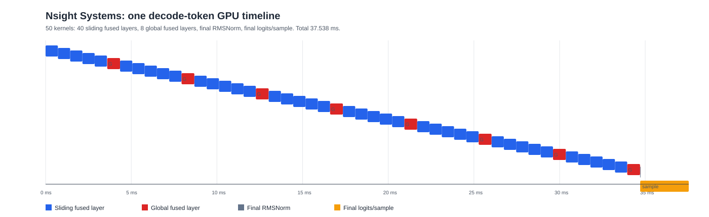
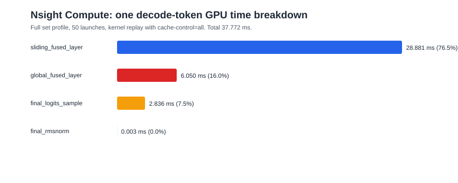
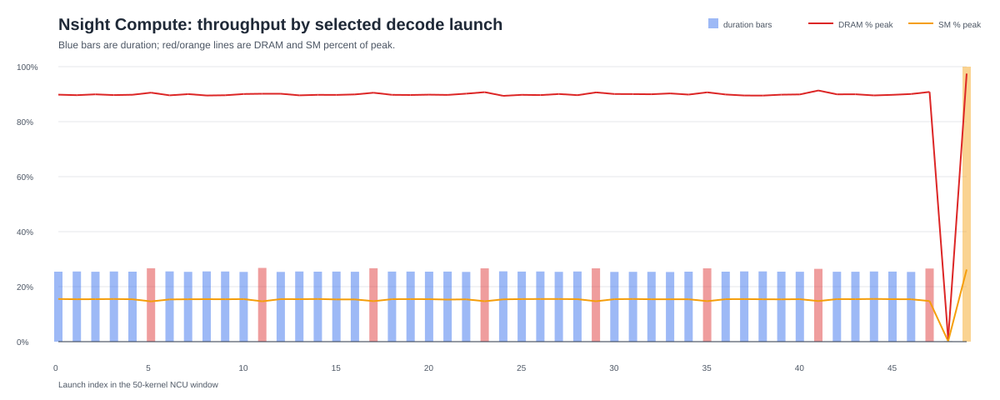
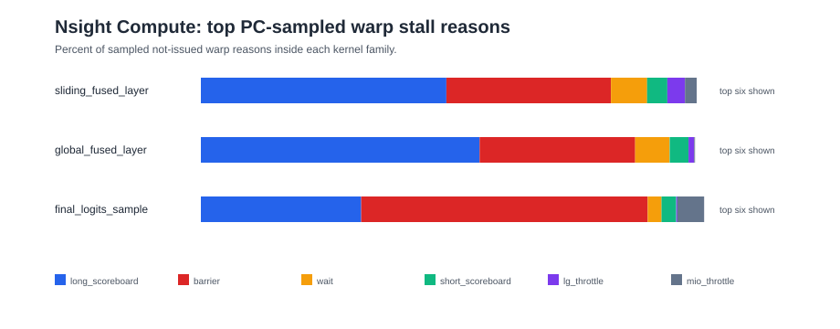

# Decode Megakernel Deep Nsight Profile - 2026-07-01

## Measurement Contract

This profile measures the existing `gemma4_prompt` decode-step path for Gemma 4
12B-it BF16 on one RTX A6000. The benchmark prompt was `Hello`, so the prompt
length was one token. The runner did one prefill outside the timed decode loop,
then repeatedly invoked `run_decode_once()`.

The primary latency number is the runner's CUDA-event timing and the Nsight
Systems GPU timeline. Nsight Compute numbers are diagnostic counters collected
with kernel replay, so they should explain bottlenecks rather than replace the
event timing.

Important environment details:

- GPU: NVIDIA RTX A6000, 48 GiB, `sm_86`.
- Driver: `580.159.03`.
- Toolkit visible to `nvidia-smi` and `nvcc`: CUDA 13.0, `nvcc V13.0.88`.
- Nsight Systems: `2025.3.2.474-253236389321v0`.
- Nsight Compute: `2025.3.1.0`.
- Repo commit: `c4e00ec397c988729b284b9602e6327d321ed5ea`.
- Model: `models/gemma-4-12B-it/model.safetensors`, about 23 GiB.
- Tokenizer: `models/gemma-4-12B-it/tokenizer.json`.
- Clock policy during the profile: SM locked to `1800 MHz`, memory locked to
  `8001 MHz`, then reset after the run.

The CUDA 13.0 toolkit is a caveat because the repo instructions say to track
CUDA 12.x. Treat this as a profile of the current machine state rather than a
canonical CUDA 12 comparison.

## Commands

Smoke run:

```bash
./build/gemma4_prompt --checkpoint models/gemma-4-12B-it/model.safetensors \
  --tokenizer models/gemma-4-12B-it/tokenizer.json --prompt Hello \
  --benchmark-mode decode-step --bench-warmup 1 --bench-iters 1 \
  --bench-samples 1
```

Nsight Systems:

```bash
nsys profile --force-overwrite=true --trace=cuda,nvtx,osrt --sample=none \
  --cuda-memory-usage=true --stats=true \
  -o src/experiments/results/2026-07-01_decode_nsight/decode_step_nsys \
  ./build/gemma4_prompt --checkpoint models/gemma-4-12B-it/model.safetensors \
  --tokenizer models/gemma-4-12B-it/tokenizer.json --prompt Hello \
  --benchmark-mode decode-step --bench-warmup 2 --bench-iters 4 \
  --bench-samples 2
```

Nsight Compute:

```bash
ncu --target-processes all --set full --launch-skip 873 --launch-count 50 \
  --replay-mode kernel --cache-control all --clock-control none \
  --force-overwrite \
  --export src/experiments/results/2026-07-01_decode_nsight/decode_step_ncu_one_decode_full \
  ./build/gemma4_prompt --checkpoint models/gemma-4-12B-it/model.safetensors \
  --tokenizer models/gemma-4-12B-it/tokenizer.json --prompt Hello \
  --benchmark-mode decode-step --bench-warmup 2 --bench-iters 4 \
  --bench-samples 2
```

The Nsight Compute launch window was selected from the Nsight Systems kernel
order. It captures one complete representative decode invocation:

```text
40 sliding fused layer kernels
 8 global fused layer kernels
 1 final RMSNorm kernel
 1 final logits/sample kernel
```

## Raw Artifacts

- `decode_step_nsys.nsys-rep`: raw Nsight Systems report.
- `decode_step_nsys.sqlite`: exported Nsight Systems sqlite database.
- `decode_step_ncu_one_decode_full.ncu-rep`: raw Nsight Compute report.
- `ncu_details.txt`: text details export.
- `ncu_raw.csv`: raw metric table, 50 profiled launches plus units row.
- `ncu_source.txt`: source-correlated export, about 307 MiB.
- `nsys_profile_stdout.txt`: Nsight Systems console summary.
- `ncu_one_decode_full_stdout.txt`: Nsight Compute console log.
- `env_after_clock_lock.csv` and `env_after_reset.csv`: GPU state snapshots.
- `nsys_decode_steps.csv`: decoded per-token GPU timeline summary.
- `nsys_kernel_summary.csv`: Nsight Systems kernel summary.
- `ncu_kind_summary.csv`: compact Nsight Compute kernel-family summary.
- `ncu_stall_summary.csv`: compact PC-sampling stall summary.

## Generated Plots









## Headline Result

The decode token is overwhelmingly memory-bound.

The runner under Nsight Systems reported:

```text
decode_step_ms n=2 mean_ms=37.798 p50_ms=37.798 p95_ms=37.896
decode_step_tps_p50=26.456
```

The per-token GPU timeline extracted from the `.sqlite` file found 12 decode
invocations:

```text
p50 GPU timeline/token: 37.743 ms
min/max GPU timeline/token: 37.538 / 37.948 ms
p50 kernel time/token: 37.704 ms
p50 inter-kernel gap/token: 0.039 ms
p50 gap share: about 0.10%
```

The launch gaps are tiny. The path is not currently launch-bound for this
single-token decode-step shape.

## One-Decode Nsight Compute Breakdown

The 50-kernel Nsight Compute window summed to `37.771584 ms`, matching the
Nsight Systems per-token timeline closely.

| Kernel family | Count | Total time | Share | Mean per launch |
| --- | ---: | ---: | ---: | ---: |
| Sliding fused layer | 40 | 28.881 ms | 76.5% | 0.722 ms |
| Global fused layer | 8 | 6.050 ms | 16.0% | 0.756 ms |
| Final logits/sample | 1 | 2.836 ms | 7.5% | 2.836 ms |
| Final RMSNorm | 1 | 0.003 ms | ~0.0% | 0.003 ms |

The layer pattern is therefore doing exactly what the architecture says:
five sliding layers, one global layer, repeated eight times. The global layer
is only about `34 us` slower than a sliding layer, but it appears eight times
instead of forty, so it is a secondary contributor.

## Memory And Compute Counters

The fused layer kernels are already close to the DRAM roofline reported by
Nsight Compute:

| Kernel family | DRAM peak % | SM peak % | DRAM GB/s | L1 hit | L2 hit |
| --- | ---: | ---: | ---: | ---: | ---: |
| Sliding fused layer | 89.8% | 15.4% | 654.7 | 37.7% | 22.4% |
| Global fused layer | 90.7% | 14.7% | 660.9 | 18.7% | 4.0% |
| Final logits/sample | 97.5% | 26.2% | 710.6 | 11.1% | 0.1% |

The final logits/sample kernel reads about `2.013 GB`, which is exactly the
scale of the tied vocabulary projection matrix:

```text
262144 vocab * 3840 hidden * 2 BF16 bytes = 2.013 GB
```

At `2.836 ms`, that is about `710 GB/s`. This kernel is very plainly a
streaming vocab-read and reduction problem.

The sliding fused layer kernels read `18.198 GB` across 40 launches, or about
`455 MB` per layer. The global fused layer kernels read `3.923 GB` across 8
launches, or about `490 MB` per layer. Those are also weight-streaming numbers.
The writes are much smaller: about `709 MB` total for sliding layers and `76 MB`
total for global layers in the one-token window.

## Occupancy And Latency Hiding

The main fused layer launch shape is:

```text
grid=(84, 1, 1), block=(512, 1, 1)
```

That is one CTA per SM on an 84-SM RTX A6000. Each CTA has 16 warps, so the
average active warp count is about 4 warps per scheduler. Nsight Compute reports
only about `0.20` eligible warps per scheduler for sliding layers and `0.19` for
global layers.

Occupancy limits from the NCU raw table:

```text
sliding: regs/thread=96, shared/block=27.884 KiB
global:  regs/thread=120, shared/block=27.156 KiB
final logits: regs/thread=64, shared/block=2.052 KiB
```

The occupancy limit columns show one block per SM for the fused layer kernels
from registers and shared memory. That low occupancy is not automatically bad
for a bandwidth-bound decode GEMV path, because adding CTAs can just increase
contention for the same memory channels. But it does explain the low eligible
warp count and the strong long-scoreboard signature.

No local spilling requests were reported for the fused layer kernels. The high
register count is buying real state rather than causing obvious local-memory
spill traffic.

## Stall Reasons

PC-sampled not-issued warp reasons:

| Kernel family | Top stalls |
| --- | --- |
| Sliding fused layer | long scoreboard 48.0%, barrier 32.2%, wait 7.1%, short scoreboard 4.0%, lg throttle 3.4% |
| Global fused layer | long scoreboard 54.5%, barrier 30.4%, wait 6.8%, short scoreboard 3.7%, branch resolving 1.5% |
| Final logits/sample | barrier 56.0%, long scoreboard 31.4%, MIO throttle 5.3%, short scoreboard 2.9%, wait 2.7% |

The fused layer kernels are waiting on memory dependencies and synchronizing a
lot. The final logits/sample kernel is a reduction over a huge streaming input,
so the barrier-heavy profile is unsurprising.

## Nsight Systems Timeline Interpretation

The decode timeline is almost entirely GPU work:

```text
12 decode invocations
50 kernels per invocation
p50 inter-kernel gap/token: 0.039 ms
max normal per-token launch gap after the first step: about 3 us
first step max gap: 14.8 us
```

Runtime API calls inside the 12-token decode period:

```text
cudaLaunchCooperativeKernel: 575 calls, 2.759 ms total, 4.799 us avg
cudaLaunchKernel:             24 calls, 0.117 ms total, 4.884 us avg
cudaMemcpyAsync:              55 calls, 0.248 ms total, 4.502 us avg
```

The large `cudaEventSynchronize` and `cudaStreamSynchronize` times in the API
summary are mostly host waits for GPU work, not CPU overhead. The GPU-side gaps
are the better signal, and they are about one tenth of one percent of token time.

## Prefill And Load Noise In The Systems Capture

The `.nsys-rep` captures process startup and model load because the runner does
not expose a profiler capture range. That is useful context but not the decode
answer.

The Systems memory summary reports about `23.815 GB` of Host-to-Device copies.
That is model loading and setup, not steady decode. The prefill path also shows
CUTLASS GEMMs in the global kernel summary, but those are outside the selected
Nsight Compute decode window.

## Main Conclusions

1. Further launch fusion is not the main lever for this shape. The decode path
   has already removed almost all GPU idle gap between kernels.
2. The fused layer kernel is a DRAM-streaming kernel. It runs at roughly
   `655-661 GB/s` and `~90%` of NCU's peak DRAM percentage while using only
   `~15%` of SM peak.
3. The final logits/sample kernel is also a hard memory-streaming problem. It
   reads the full tied embedding / LM head matrix every token and costs about
   `2.84 ms`.
4. The largest instruction-issue blockers are long scoreboard and barriers.
   That points to memory-dependency latency plus synchronization inside the
   fused layer, not insufficient arithmetic throughput.
5. The current one-CTA-per-SM design is probably intentional for a streaming
   decode path, but it leaves only about 0.2 eligible warps per scheduler.
   Any attempt to increase resident CTAs must be benchmarked against DRAM
   saturation, not assumed to help.

## Optimization Directions Worth Testing

The highest-probability improvements are byte-reduction improvements:

- Weight-only quantization for the fused layer path.
- Quantized or compressed final vocab projection if quality constraints allow.
- Any reuse-aware layer scheduling that reduces rereads without adding enough
  synchronization/register pressure to lose the gain.
- Very targeted barrier reduction inside the fused layer if source correlation
  points to unnecessary synchronization.

Lower-probability improvements:

- CUDA graphs for this exact decode-step path. The GPU-side gaps are too small
  for this to materially change token latency, though it could still help
  host-visible serving under higher request orchestration pressure.
- Pure math tuning of the fused layer. The SM peak percentage is too low for
  math to be the first suspect.
- More occupancy by itself. It may reduce long scoreboard waits, but the kernel
  is already close to DRAM saturation.

## Threats To Validity

- The profiler machine has CUDA 13.0, not the project-preferred CUDA 12.x.
- Nsight Compute used kernel replay and `--cache-control all`, so cache behavior
  is diagnostic and not identical to the warm decode loop.
- The prompt length was one token. Longer prompts change KV-cache state and may
  change attention/cache behavior.
- This is batch/concurrency 1. Batched decode is a separate performance regime.
- The generated SVGs are reconstructed from profiler exports, not screenshots
  from the Nsight GUI.
